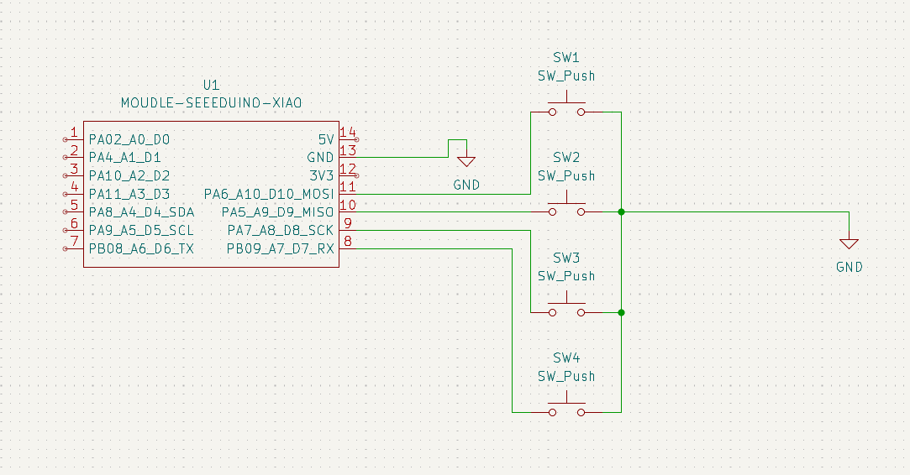
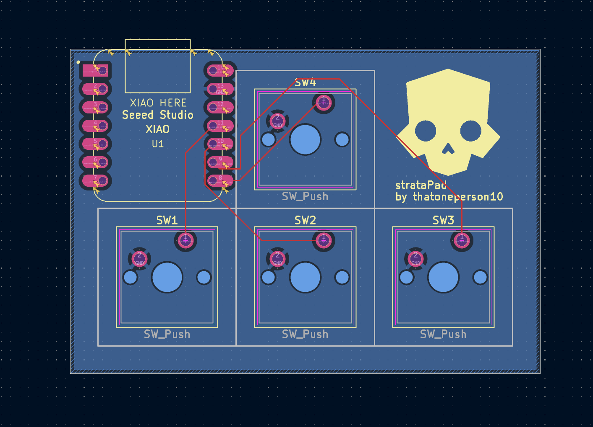

# strataPad

A compact 4-key mechanical macropad built around the Seeed Studio XIAO RP2040. The project includes a custom PCB designed in KiCad, a 3D printed enclosure designed in Onshape, and QMK firmware.

---

## Overall Hackpad

The completed strataPad.

---

## Schematic

The KiCad schematic showing the XIAO RP2040 connected directly to four mechanical switches using GPIO pins.

---

## PCB

View of PCB designed in KiCAD, with the Helldivers logo and wires.

---

## Case & Assembly

Exploded render showing the enclosure, switches, keycaps, PCB, and Seeed Studio XIAO RP2040.

---

## Bill of Materials

| Part | Quantity |
|------|---------:|
| Seeed Studio XIAO RP2040 | 1 |
| MX Mechanical Switches | 4 |
| MX-compatible Keycaps | 4 |
| Custom PCB | 1 |
| 3D Printed Top Case | 1 |
| 3D Printed Bottom Case | 1 |
| USB-C Cable | 1 |

A complete BOM is available in **BOM.csv**.

---

## Production Files

The `production/` folder contains everything needed to build the project:

- `firmware.uf2`
- `gerbers.zip`
- `top.stl`
- `bottom.stl`
- `top.step`
- `bottom.step`
- `assembly.step`
